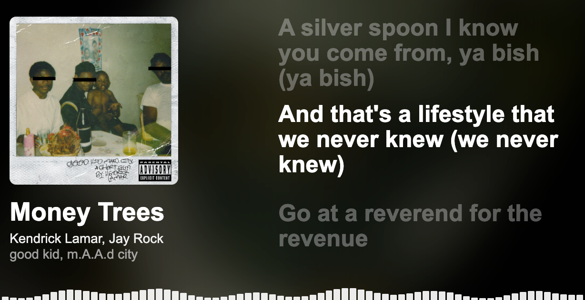

# Music Visualizer



> **ONLY FOR SPOTIFY!!! WORKS ONLY IN CHROME!!!**

A fullscreen music visualization web application for displaying Spotify playback on a projector or large screen.

Spotify handles music playback. Music Visualizer reads the current track information and creates the visual presentation.

## Features

- Spotify authorization via PKCE
- Track title, artists and album
- Album artwork and blurred rotating background
- Playback progress synchronization
- Animated visualizer bars
- Synchronized lyrics via LRCLIB
- Cover-only mode when lyrics are unavailable
- Smooth track transitions
- Sidebar controls

## How It Works

```text
Spotify
   │
   │ Web API
   ▼
Music Visualizer
   │
   ├── Track information
   ├── Album artwork
   ├── Playback progress
   └── Synchronized lyrics
```

The application does **not** receive or process the Spotify audio stream.

## Project Structure

```text
music-visualizer/
│
├── index.html
├── style.css
├── app.js
├── spotify.js
├── lyrics.js
└── README.md
```

- `index.html` — application structure
- `style.css` — layout and visual design
- `app.js` — visualizer logic
- `spotify.js` — Spotify API and authentication
- `lyrics.js` — LRCLIB and LRC parsing

## Requirements

- Spotify account
- Spotify Developer application
- Visual Studio Code
- Live Server extension
- **Google Chrome**

> The application is currently designed and tested for **Google Chrome**.

Python and a backend server are **not required**.

## Spotify Setup

### 1. Create a Spotify application

Open the [Spotify Developer Dashboard](https://developer.spotify.com/dashboard/).

Click **Create app** and fill in:

**App Name**
```text
Music Visualizer
```

**App Description**
```text
A visual music experience that displays Spotify playback information and synchronized lyrics.
```

**Website**

Leave empty.

**Redirect URI**
```text
http://127.0.0.1:5500
```

Select **Web API** if requested and accept the Developer Terms.

Click **Create**.

### 2. Configure Redirect URI

Open the application settings and find **Redirect URIs**.

Add:

```text
http://127.0.0.1:5500
```

Save the settings.

The Redirect URI must exactly match the address used by Live Server.

### 3. Add the Client ID

In the Spotify application settings, copy the **Client ID**.

Open:

```text
spotify.js
```

Find:

```js
clientId: "YOUR_CLIENT_ID",
redirectUri: "http://127.0.0.1:5500",
```

Replace `YOUR_CLIENT_ID` with your Client ID:

```js
clientId: "1234567890abcdef1234567890abcdef",
redirectUri: "http://127.0.0.1:5500",
```

The **Client ID** and **Redirect URI** are different values.

### 4. Client Secret

Do **not** add the Client Secret to the project.

The application uses **Authorization Code with PKCE**, so the Client Secret is not required.

Never upload a Client Secret to GitHub.

## Running

### 1. Open the project

Open the project folder in VS Code.

### 2. Start Live Server

Open `index.html`, right-click it and select:

```text
Open with Live Server
```

Chrome should open:

```text
http://127.0.0.1:5500
```

### 3. Connect Spotify

Move the cursor to the **left edge of the screen**.  
The hidden sidebar will appear. Then click:

```text
Connect Spotify
```

Log in to Spotify and authorize the application.

### 4. Start playing music

Play a song in Spotify.

Music Visualizer will automatically display:

- song title
- artist
- album
- album artwork
- playback progress
- synchronized lyrics when available

Changing the song in Spotify automatically updates the visualizer.

## Lyrics

Synchronized lyrics are loaded from **LRCLIB**.

Only synchronized lyrics are used. If they are unavailable, the visualizer switches to **cover-only mode**.

## Important Notes

Spotify controls the actual music playback. The visualizer only reads playback metadata through the Spotify Web API.

The bottom visualizer bars are animated graphics and are **not** generated from the Spotify audio stream.

The project is currently intended for local use with VS Code Live Server.

## Future Development

- More visual themes
- Improved lyric synchronization
- Additional visual effects
- Experimental audio-reactive visualization
- Interactive presentation elements

## License

This project is intended for personal and educational use