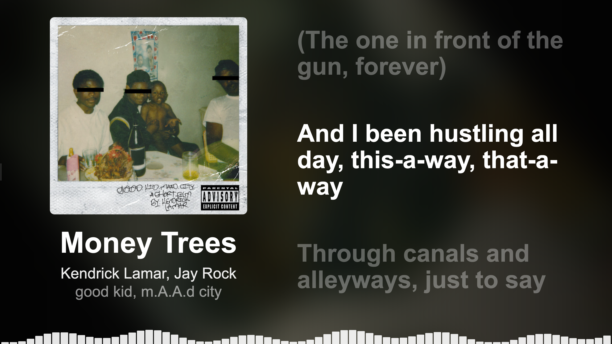
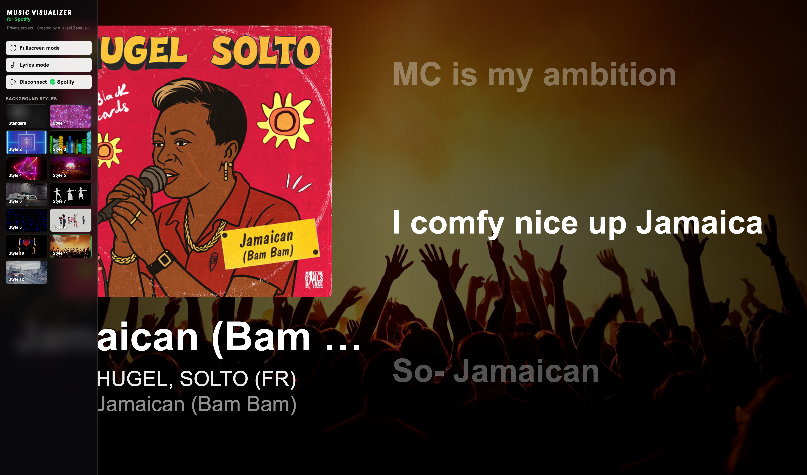
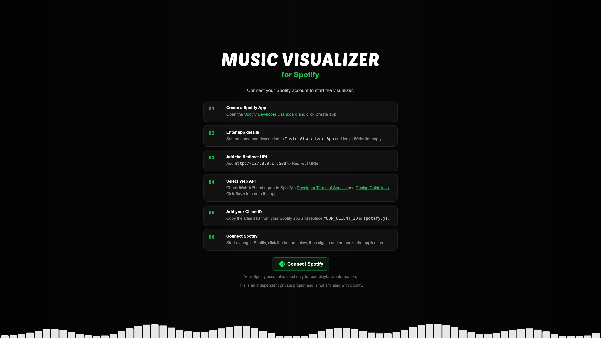

# Music Visualizer for Spotify



> **This is an independent private project and is not affiliated with Spotify.**

A fullscreen music visualization web application for displaying Spotify playback on a projector or large screen.

Spotify handles music playback. Music Visualizer reads the current track information and creates the visual presentation.

## Features




- Spotify authorization via PKCE
- Track title, artists and album
- Album artwork and blurred rotating background
- Playback progress synchronization
- Animated visualizer bars
- Synchronized lyrics via LRCLIB
- Cover-only mode when lyrics are unavailable
- Smooth track transitions
- Sidebar controls

## Requirements

- Spotify account
- Spotify Developer application
- Visual Studio Code
- Live Server extension
- Browser

## Running

### 1. Open the project

Open the project folder in VS Code.

### 2. Start Live Server

Open `index.html`, right-click it and select:

```text
Open with Live Server
```

Chrome should open:

```text
http://127.0.0.1:5500
```

## Spotify Setup



When you open the application for the first time, a setup screen will guide you through the Spotify configuration.

### 1. Create a Spotify App

Open the [Spotify Developer Dashboard](https://developer.spotify.com/dashboard/) and click **Create app**.

### 2. Enter app details

Set the name and description to:

```text
Music Visualizer App
```

Leave **Website** empty.

### 3. Add the Redirect URI

Add the following address to **Redirect URIs**:

```text
http://127.0.0.1:5500
```

The Redirect URI must exactly match the address used by Live Server.

### 4. Select Web API

Check **Web API** and agree to Spotify's [Developer Terms of Service](https://developer.spotify.com/terms) and [Design Guidelines](https://developer.spotify.com/documentation/design).

Click **Save** to create the app.

### 5. Add your Client ID

Copy the **Client ID** from your Spotify app.

Open:

```text
spotify.js
```

Find:

```js
clientId: "YOUR_CLIENT_ID",
```

Replace `YOUR_CLIENT_ID` with your Client ID:

```js
clientId: "1234567890abcdef1234567890abcdef",
```

The **Client ID** is the only Spotify credential required by this project. The application uses **Authorization Code with PKCE**, so the Client Secret is not required and must not be added to the project.

### 6. Connect Spotify

Start a song in Spotify, click **Connect Spotify**, then sign in and authorize the application.

After successful authorization, the setup screen will disappear and the visualizer will start displaying your current Spotify playback.

Once connected, the Visualizer controls are also available from the sidebar by moving the cursor to the **left edge of the screen**.

## Lyrics

Synchronized lyrics are loaded from **LRCLIB**.

Only synchronized lyrics are used. If they are unavailable, the visualizer switches to **cover-only mode**.

## How It Works

```text
Spotify
   │
   │ Web API
   ▼
Music Visualizer
   │
   ├── Track information
   ├── Album artwork
   ├── Playback progress
   └── Synchronized lyrics
```

The application does **not** receive or process the Spotify audio stream.

## Project Structure

```text
music-visualizer/
│
├── index.html
├── style.css
├── app.js
├── spotify.js
├── lyrics.js
└── README.md
```

- `index.html` — application structure
- `style.css` — layout and visual design
- `app.js` — visualizer logic
- `spotify.js` — Spotify API and authentication
- `lyrics.js` — LRCLIB and LRC parsing

## Important Notes

Spotify controls the actual music playback. The visualizer only reads playback metadata through the Spotify Web API.

The bottom visualizer bars are animated graphics and are **not** generated from the Spotify audio stream.

The project is currently intended for local use with VS Code Live Server.

## License

This is an independent private project and is not affiliated with Spotify.